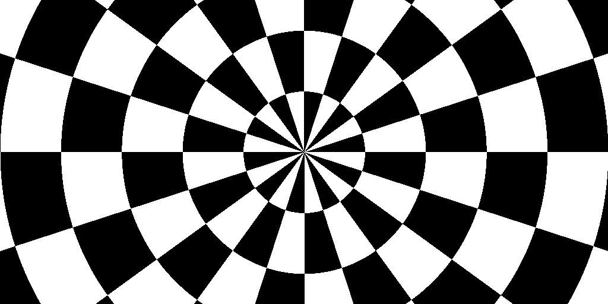

+++
title = "Functional Image Synthesis"
date = 2019-04-11

[extra]
author = "Keith Schulze"

[taxonomies]
tags = ["rust", "image processing"]
+++

For a systems programming language, Rust is surprisingly expressive. Enough so, one can encode image synthesis and processing
routines in a delightfully functional way.
<!-- more -->
When learning a new programming language, it's common for developers to have a
familiar problem they solve to kick the tires of the language. For me, it's
typically some variation of Conal Elliot & company's
[`Pan`](http://conal.net/pan/) library for image synthesis and processing.
`Pan` was originally implemented in Haskell and there's a [Functional Images
chapter](http://conal.net/papers/functional-images/) in the [Fun of Programming
book](https://www.cs.ox.ac.uk/publications/books/fop/) that describes some of
the core concepts, primitives and abstractions in `Pan`.  While it was
published some time back, I still find the simplicity and composability of the
primitives in the book chapter very compelling. I've previously implemented
some of these concepts in Scala (perhaps a blog post for another time), but
recently I thought I'd see if I could express some of the concepts in Rust and,
hopefully, learn some Rust in the process. So this post is intended to be the
first in a series that will explore how to encode the functional image
synthesis and processing concepts described in the Functional Images book
chapter using Rust.

Note: You can launch and play with an interactive version of the code for this
blog post on [binder](https://mybinder.org/):
[](https://mybinder.org/v2/gh/keithschulze/keithschulze/master?filepath=notebooks%2F2019-04-11-functional-img-rust-part1.ipynb)

# What is an image?

This seemingly simple question typically yields an array of answers, usually
including some mention of 2D/3D arrays or matrices--that's precisely what
came to mind when I first thought about the question. It turns out there's a
simpler and more elegant way to represent images: A function that takes a set
of coordinates and produces a pixel value. In Haskell, it looks something like
this:

```haskell
type Coord = (Float, Float)
type Img a = Coord -> a
```

`Img` represents a mapping from a coordinate (`Coord`) to a pixel value `a`,
where `Coord` is just an alias for a Tuple of floating point numbers that
represent a coordinate in a continuous 2D space. There are a couple of
essential concepts embedded in this definition that are worth calling out.
First, the definition is polymorphic over the pixel type (i.e., it's some type
`a`), which means we're not committing to a concrete representation for pixels
yet.  Second, coordinates are in a continuous space, which is entirely
different from representing images as 2D arrays/matrices with discrete
coordinates.

# Expressing Img in Rust
**TL;DR:** I had a few issues finding an appropriate way to express the notion
of an `Img<A>` in Rust initially. Traits along with the recently added `impl
Trait` were what I landed on. <a href="#link1">Skip ahead</a> if you aren't interested in
the details of how I worked my way towards that.

Can we express this in Rust? Rust supports anonymous functions via closures,
which have an instance of the `Fn` trait (or typeclass). I naively assumed that
`Fn(Coord) -> A` might be the type of a closure and, since rust also supports
type aliases, I tried to create a type alias for `Fn(Coord) -> A`, similar to
the Haskell implementation:

```rust
type Coord = (f32, f32);
type Img<A> = Fn(Coord) -> A;
```

The code block above doesn't actually compile because one can't alias traits in
Rust, but there's a more general problem here: `Fn(Coord) -> A` is a trait (or
type bound) rather than a type. Whatever type does represent `Img<A>`, needs
to satisfy this bound/constraint (i.e., the type should have an instance of
`Fn(Coord) -> A`), but it is not a type itself. I don't want to get too deep
into all my initial misconceptions about closures in Rust, so I'll cut a long
story short: every closure in Rust has a different type, and it's difficult to
refer to the type without Boxing the closure--something we'd like to avoid.
Aliasing a closure is, therefore, a bit of a dead-end.

<a name="link1"></a>Rust recently added the ability to return an anonymous
implementation of a trait using `impl Trait`. Thus, we can create a trait that
extends `Fn(Coord) -> A` and use this as a type bound on functions that accept
or produce images. Put another way, for a type to fulfil the `Img<A>` type
bound, it should also fulfil the `Fn(Coord) -> A` constraint.

```rust
type Coord = (f32, f32);

trait Img<A> : Fn(Coord) -> A {}
impl <F, A> Img<A> for F where F: Fn(Coord) -> A {}
```

If you're not familiar with Rust that might look a little intimidating, so
let's break it down. In the second line, we declare a new trait `Img<A>` that
extends `Fn(Coord) -> A`. In line 3, we provide a mechanism to lift any
function that satisfies the constraint `Fn(Coord) -> A` to an `Img<A>`.

# Image regions
Now that we have a representation for `Img`, we can express another type
featured in the Functional Images book chapter: `Region`. `Region`'s, an alias
for type `Img<bool>`, represent a mask where the pixel value, a boolean,
denotes whether that pixel falls inside the region or not.

```rust
trait Region : Img<bool> {}
impl <F> Region for F where F: Fn(Coord) -> bool {}
```

Let's create a few example `Region`s from the book to get a feel for what it's
like to synthesise images using this API.  Note, we'll see how to render
bitmaps for an `Img` a little later in the post, but for now, just assume we
can produce an image from an `Img`. `vstrip` defines an infinite vertical
band centred on the y-axis of the image:

```rust
pub fn vstrip() -> impl Region {
    |(x, _y): Coord| x.abs() <= 0.5
}
```


Another example is `checker` (one of my personal favourites):

```rust
pub fn checker() -> impl Region {
    |(x, y): Coord| ((x.floor() + y.floor()) as u32).is_even()
}
```


We can also define a function that produces alternating rings around the origin
of the image:

```rust
pub fn dist_o(c: Coord) -> f32 {
    let (x, y) = c;
    (x * x + y * y).sqrt()
}

pub fn alt_rings() -> impl Region {
    |p| (dist_o(p).floor() as i32).is_even()
}
```


`dist_o` simply calculates the distance of a `Coord` from the origin, i.e.,
`Coord(0.0, 0.0)`, and `alt_rings` just checks whether the `floor` of a
coordinates distance from the origin is an even number to determine whether the
coordinate belongs to the `Region`.

One thing worth emphasising in the  `vstrip`, `checker` and `alt_rings`
examples is that they all define unbounded (or infinite) images. We can render
any part of a potentially infinitely large image at any resolution by simply
sampling 'pixel' values across the region we want at a frequency we specify.
Using a function to represent images is quite different from the traditional
approach of representing images as multidimensional arrays of discrete pixel
values. Note, however, that we can easily recover the bounded and discretised
representation of an image by sampling our continuous space at discrete
coordinates. We'll come back to this when we talk about rendering
images.

For certain image processing operations, it’s more convenient to reference
spatial locations in an image using a Polar coordinate system rather than the
typical cartesian coordinate system. In a polar coordinate system, we define a
coordinate by their distance (or radius) and angle from the origin.  We can
create a type to represent polar coordinates and some functions to transform a
cartesian coordinate to its polar form and back again:

```rust
pub type Polar = (f32, f32);

pub fn to_polar(c: Coord) -> Polar {
    let (x, y) = c;
    (dist_o(c), y.atan2(x))
}

pub fn from_polar(polar: Polar) -> Coord {
    let (p, theta) = polar;
    (p * theta.cos(), p * theta.sin())
}
```

Note that, similar to our `Coord` type, the `Polar` type is really just an
alias for a Tuple2 of `f32`s.

The superpower of representing `Img` as a function is that it possesses all the
properties of a function, like composition! The Rust `stdlib` doesn't provide a
function for composing closures; however, this is relatively straight forward
to implement:

```rust
pub fn compose<A, B, C, F, G>(f: F, g: G) -> impl Fn(A) -> C + Copy
where
    F: Fn(B) -> C + Copy,
    G: Fn(A) -> B + Copy,
{
    move |x| f(g(x))
}
```

As in the Functional Images book chapter, we can start to synthesise some
interesting images by composing `Img`s with functions that transform
coordinates input coordinates or output values. An example given in the book is
`polarChecker` (called `polar_checker` here), which creates a polar
checkerboard.

```rust
pub fn polar_checker(n: i32) -> impl Region {
    let sc = move |polar: Polar| -> Polar {
        let (p, theta) = polar;
        (p, theta * (n as f32 / PI))
    };
    compose(checker(), compose(sc, to_polar))
}
```



# Drawing Img's
Before we finish up this post, I'd like to digress for a moment into how we
render a bitmap (e.g., those above) for our abstract `Img` representation—after
all, the beauty of an image lies in seeing it. Instead of writing logic for
encoding different image formats, we're just going to make use an existing
library to do it. The crew at `PistonDevelopers` have published a nice image
processing library called [`image`](https://github.com/PistonDevelopers/image)
that can encode a variety of image formats, including `png` and `jpeg`. I'll
leave the deep dive into `image` as an exercise for the reader; however, it's
worth pointing out a couple of important structures and functions we'll be
using. `ImageBuffer` is one of the internal representations for images in
`image`, and the function `from_fn` let's one create an `ImageBuffer` from a
function that accepts the `x` and `y` coordinates of the image; this maps
nicely to the `Fn(Coord) -> A` representation of `Img`.

For the sake of simplicity, we'll focus on rendering binary `Img`'s, i.e.
`Img<bool>`, for purposes of this post; rendering grayscale and colour images
uses a similar pattern. The `image` library denotes grayscale pixels with the
`Luma` type and only officially supports a single underlying datatype, `u8`, so
our target output type needs to be `ImageBuffer<Luma<u8>>`. Given the input
type  `Region` is an `Img<bool>`, our `render` function needs to convert the
pixels to `u8` and then scale our `bool` value across the dynamic range, such
that `false = 0` and `true = 255`:

```rust
type Vector = (f32, f32);

fn render<F: Region>(
    im: F,
    width: u32,
    height: u32,
    origin: Vector,
    pixel_size: Vector,
) -> ImageBuffer<Luma<u8>, Vec<u8>> {
    let (pw, ph) = pixel_size;
    let (ox, oy) = origin;
    image::ImageBuffer::from_fn(width, height, |x, y| {
        let pixel = im((x as f32 * pw - ox, y as f32 * ph - oy)) as u8;
        image::Luma([pixel * 255])
    })
}
```
The `render` function takes a number of input parameters:

* `im` -- `Img` to render
* `width`, `height` -- Desired size of render output image (pixels)
* `origin` -- Location or offset of the origin (in continuous space) relative to
   the top left of the rendered image.
* `pixel_size` -- Sampling frequency or size of each discrete pixel in the
   continuous coordinate space. This is the inverse of DPI.

# Concluding remarks
Rust's closures and `impl trait` provide a reasonably elegant mechanism to
express the functional image synthesis and processing concepts detailed in the
Functional Images chapter of the Fun of Programming Book. We can express a lot
more of the concepts in that chapter, and in future posts, I hope to walk
through how to encode and render grayscale and colour images, perform image
transformations (e.g., crop, scale, rotate etc.), apply image filters, do
algebra on regions, and render bitmaps images.
